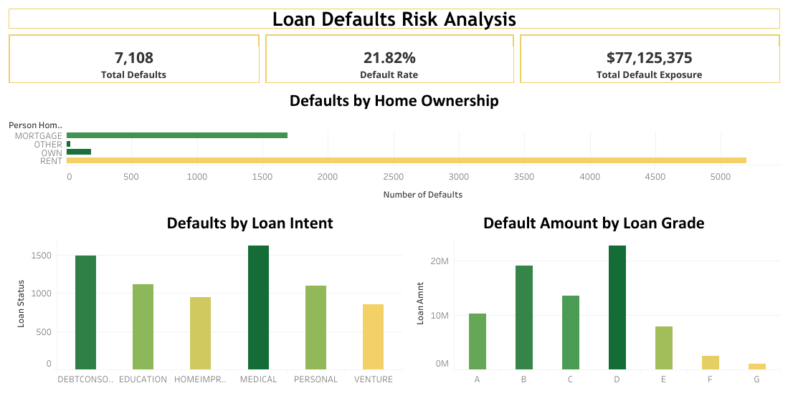

# 📊 Credit Risk & Loan Defaults Dashboard

An interactive Tableau dashboard designed to analyze borrower risk profiles, default patterns, and financial exposure across various loan categories.

🔗[Live Interactive Dashboard on Tableau Public](https://public.tableau.com/app/profile/duaa.jaafar/viz/CreditRiskDashboard_17911284936460/Dashboard1)*

---

## 🖼️ Dashboard Preview

---

## 📌 Project Overview
This project visualizes credit risk factors to help lenders identify high-risk applicant segments, understand default distributions, and optimize risk assessment strategies.

---

## 📈 Key Metrics (KPIs)
- *Total Defaults:* 7,108 loans
- *Default Rate:* 21.82%
- *Total Default Exposure:* $77,125,375

---

## 🔍 Key Insights
- *Home Ownership:* Borrowers who rent represent the largest segment of loan defaults compared to homeowners or mortgage holders.
- *Loan Purpose:* Medical and Debt Consolidation loans exhibit the highest frequency of default.
- *Loan Grades:* Borrowers in lower loan grades (Grades B and D) account for the largest exposure in defaulted amounts.

---

## 🛠️ Tools & Technologies
- *Tableau Public* (Interactive Visualizations & Dashboard Design)
- *Data Analytics & Risk Assessment*
